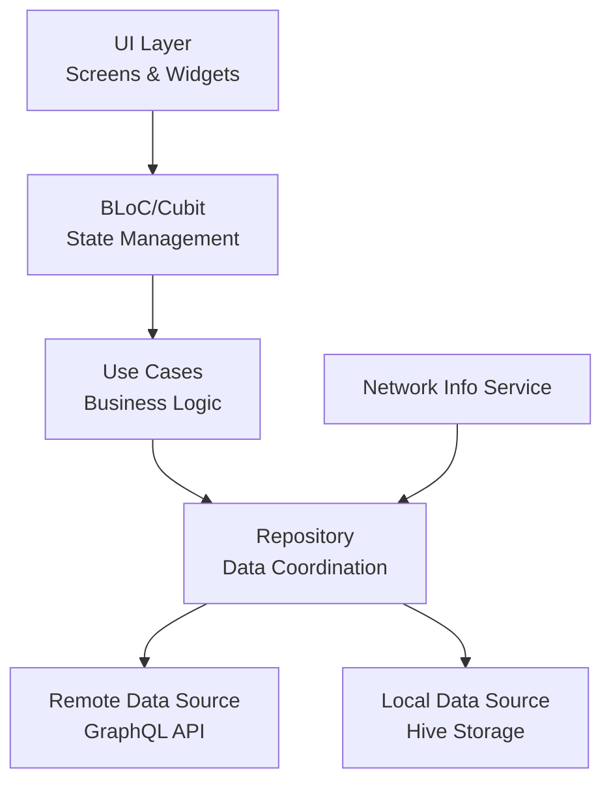

# Jitta Rank 📈

#### A Flutter application for viewing and analyzing stock rankings with offline support, implementing Clean Architecture principles and the BLoC pattern for state management.


*⚠️ Jitta Rank **is not an official** Jitta product! ⚠️*

*🚀 Built as a 7-day challenge to push my skills in architecture, state management, and performance optimization. Expect clean code, but maybe also some late-night debugging magic. 🌚✨🐛🌝*

## Overview

Jitta Rank is a mobile application that allows users to:

- View ranked stocks with their performance metrics and Jitta scores

- Search stocks by name and filter by sectors

- View detailed stock information including price history and financial metrics

- Access data offline through local caching

- Real-time network connectivity monitoring

## Features
**Stock Ranking List**
- View ranked stocks with performance metrics
- Search & filter stocks by symbol, name, sector, and market
- Pull-to-refresh for the latest data
- Infinite scroll with lazy loading
- Offline support with local caching
- Error handling with retry options

**Stock Detail**
- Jitta score and financial analysis
- View comprehensive stock information
- Interactive price history graph
- Real-time price updates (when online)
- Offline access to previously loaded data

## Architecture
The application follows Clean Architecture principles with three main layers:

```
lib/
├── core/          		# Shared core functionality
│ ├── error/	 		# Error handling and exceptions
│ ├── navigation/ 		# Navigation management
│ └── networking/ 		# Network services and connectivity
├── features/ 			# Feature modules
│ ├── stock_ranking/ 	        # Stock ranking feature
│ │ ├── data/ 			# Data layer (repositories, models, datasources)
│ │ ├── domain/ 		# Business logic (repositories(abstract), entities, usecases)
│ │ └── presentation/ 	        # UI layer (screens, widgets, blocs)
│ └── stock_detail/ 	        # Stock detail feature
└── main.dart
```

## High-Level Architecture Diagram



## Data Flow

1. UI triggers events through BLoC/Cubit
2. BLoC executes appropriate use cases
3. Use cases interact with repositories
4. Repository:
   - Checks network connectivity
   - Fetches from GraphQL API if online
   - Falls back to local cache if offline
   - Updates local cache with new data
5. UI updates based on new states from BLoC

## State Management

The application uses BLoC pattern with the following components:

- **StockRankingsBloc**: 
    - Manages stock list state
    - Handles pagination
    - Implements search and filtering
    - Manages data refresh

- **StockDetailBloc**: 
    - Manages stock detail state
    - Manages data refresh

- **NetworkInfoBloc**: 
    - Monitors network connectivity

- **NavigationCubit**: 
    - Handles app navigation
    - Maintains navigation state
    - Manages navigation history

## GraphQL implementation features:
- Network-only fetch policy
- HTTP link configuration
- In-memory store
- Accepts partial data
- Network-first data fetching
- Basic error handling
- Optimistic cache merging

## Local Storage (Hive)

Hive is used for local storage with the following type adapters:

```dart
- RankedStockModel
- SectorModel
- StockModel
- StockPriceModel
- StockJittaModel
- StockJittaFactorModel
- StockJittaFactorGrowthModel
- StockJittaFactorFinancialModel
- StockJittaFactorManagementModel
- StockGraphPriceItemModel
- StockGraphPriceModel
```

Box configurations:
- ranked_stocks: Cached stock rankings
- sectors: Available market sectors
- stock_detail: Detailed stock information
- stock_price: Historical price data
- stock_jitta: Jitta analysis data
- stock_jitta_factor: Jitta factor analysis data
- stock_jitta_factor_growth: Jitta factor growth analysis data
- stock_jitta_factor_financial: Jitta factor financial analysis data
- stock_jitta_factor_management: Jitta factor management analysis data
- stock_graph_price_item: Historical price data for graph
- stock_graph_price: Graph price data

## Error Handling

The application implements comprehensive error handling:
- API errors
- Cache failures
- Data validation
- Network connectivity issues
- UI error messages with retry options

## Setup & Installation

## Prerequisites

- Flutter SDK (2.19.0 or higher)
- Dart SDK (3.0.0 or higher)
- Android Studio / VS Code with Flutter extensions
- A device or emulator running Android/iOS

## Dependencies

Key dependencies used in this project:

```yaml
dependencies:
  flutter_bloc: ^8.1.4 # state management
  equatable: ^2.0.5 # for comparing objects
  graphql_flutter: ^5.1.2 # for graphql
  internet_connection_checker: ^1.0.0 # for checking internet connection
  hive: ^2.2.3 # for local database
  hive_flutter: ^1.1.0
  fl_chart: ^0.70.0 # for chart
  dartz: ^0.10.1 # for error handling
```

## Getting Started

1. Clone the repository:
```bash
git clone https://github.com/igroomgrim/jitta_rank.git
```

2. Install dependencies:
```bash
flutter pub get
```

3. Generate Hive adapters:
```bash
flutter pub run build_runner build
```

4. Run the app:
```bash
flutter run
```

## Testing

The project includes:

- [x] Unit Tests (Services, Repositories, Use Cases)
- [ ] Widget Tests (UI Components)
- [ ] Integration Tests (End-to-End Testing)

```bash
# Run all tests
flutter test

# Run specific test file
flutter test test/features/stock_ranking/repositories/stock_ranking_repository_test.dart

# Run with coverage
flutter test --coverage
```

## Contributing

1. Fork the repository
2. Create your feature branch (`git checkout -b feature/no-more-magic-feature`)
3. Commit your changes (`git commit -m 'Add more magic feature'`)
4. Push to the branch (`git push origin feature/no-more-magic-feature`)
5. Open a Pull Request

## After coffee break
- [ ] More clean code
- [ ] More tests
- [ ] More integration tests
- [ ] More error handling
- [ ] More UI Animation
- [ ] More performance optimization
- [ ] More documentation
- [ ] More dependency injection
- [ ] More sleep

## License

This project is licensed under the MIT License - see the LICENSE file for details

## Acknowledgments

- Jitta for inspiration and stock analysis methodology
- Flutter team for the amazing framework
- Contributors and maintainers of used packages
- My wife and daughter for their **กำลังใจ** (support and encouragement) 👩🏻‍🍳👧🏻
