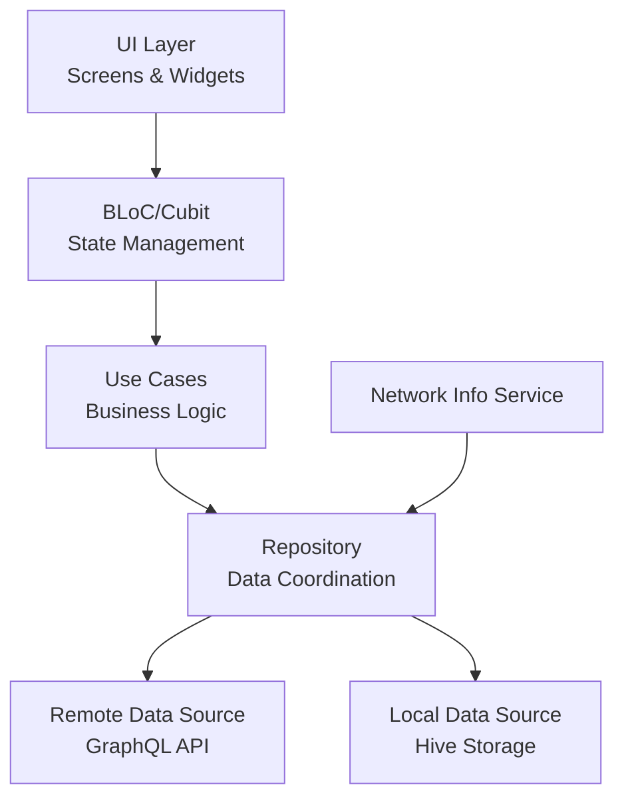

# Jitta Rank 📈

#### A Flutter application for viewing and analyzing stock rankings with offline support, implementing Clean Architecture principles and the BLoC pattern for state management.


*⚠️ Jitta Rank **is not an official** Jitta product! ⚠️*

*🚀 Built as a 7-day challenge to push my skills in architecture, state management, and performance optimization. Expect clean code, but maybe also some late-night debugging magic. 🌚✨🐛🌝*

## Overview

Jitta Rank is a mobile application that allows users to:

- View ranked stocks with their performance metrics and Jitta scores

- Search stocks by name and filter by sectors

- View detailed stock information including price history and financial metrics

- Access data offline through local caching

- Real-time network connectivity monitoring, with an automatic refetch when the
  connection comes back

## Features
**Stock Ranking List**
- View ranked stocks with performance metrics
- Search & filter stocks by symbol, name, sector, and market
- Pull-to-refresh for the latest data
- Infinite scroll with lazy loading
- Offline support with local caching
- Error handling with retry options

**Stock Detail**
- Jitta score and financial analysis
- View comprehensive stock information
- Interactive price history graph
- Real-time price updates (when online)
- Offline access to previously loaded data

## Architecture
The application follows Clean Architecture principles with three main layers:

```
lib/
├── core/               # Shared core functionality
│ ├── constants/        # API and pagination defaults
│ ├── di/               # GetIt container (single place the graph is wired)
│ ├── error/            # Typed exceptions (data layer) and failures (domain)
│ ├── navigation/       # Routes and navigation cubit
│ ├── networking/       # GraphQL client and connectivity
│ ├── observers/        # Debug-only BlocObserver
│ ├── storage/          # Hive setup and box names
│ └── theme/            # Light/dark themes and semantic colour tokens
├── features/           # Feature modules
│ ├── stock_ranking/
│ │ ├── data/           # Models (Hive + JSON), datasources, repository impl
│ │ ├── domain/         # Entities, repository interfaces, usecases
│ │ └── presentation/   # Screens, widgets, blocs
│ └── stock_detail/     # Same three layers
└── main.dart
```

## High-Level Architecture Diagram


```mermaid
graph TD
    A[UI Layer<br/>Screens & Widgets] --> B[BLoC/Cubit<br/>State Management]
    B --> C[Use Cases<br/>Business Logic]
    C --> D[Repository<br/>Data Coordination]
    D --> E[Remote Data Source<br/>GraphQL API]
    D --> F[Local Data Source<br/>Hive Storage]
    G[Network Info Service] --> D
```

## Data Flow

1. UI dispatches an event (from `initState` or a user action — never from
   `build()`)
2. Bloc calls a use case
3. Use case calls a repository, which returns `Either<Failure, T>`
4. Repository coordinates only:
   - checks connectivity
   - online → GraphQL, then writes through to the cache
   - offline → reads the cache, filtered and paged by the datasource
   - maps typed exceptions to failures
5. Datasources hand back **models**; the repository maps them to **entities**,
   so the domain never sees a Hive or JSON type
6. Bloc emits a new state; the UI rebuilds

## State Management

The application uses BLoC pattern with the following components:

Each feature has one bloc holding a **single state class with a status enum**
(`initial` / `loading` / `loadingMore` / `success` / `failure`) rather than a
subclass per status. That matters for one specific reason: a failure carries the
data it failed on, so a load-more that fails mid-scroll shows an inline retry
under the existing list instead of replacing the screen with an error.

- **StockRankingsBloc** — list, pagination, filtering. Load-more is throttled
  and droppable, and terminates when a page comes back empty.
- **StockDetailBloc** — one stock's detail, and refresh.
- **NetworkInfoBloc** — subscribes to a connectivity stream on construction and
  cancels on close; the list screen refetches on an offline → online edge.
- **NavigationCubit** — navigation intent, so widgets do not reach for
  `Navigator` directly.

Blocs are registered with GetIt as **factories**, not singletons: `BlocProvider`
takes ownership of what its `create` builds and closes it on dispose, so a
singleton would be handed back already closed.

Events are never dispatched from `build()`. Initial loads happen in `initState`
and load-more is driven by a `ScrollController`, so no fetch is a side effect of
painting.

## GraphQL

- Network-only fetch policy over an `HttpLink`, with an in-memory store
- Endpoint is configurable per environment via `--dart-define=API_BASE_URL`
- Queries live in `data/datasources/queries/`, not inline in the datasources
- Datasources throw typed exceptions — `ServerException` for a failed or empty
  response, `SerializationException` for a payload that will not parse — and
  repositories map those to the matching `Failure`

## Local Storage (Hive)

Adapters are generated from the `@HiveType` annotations by `hive_ce_generator`
into `lib/hive_registrar.g.dart`, so the registration list cannot drift out of
sync with the models.

Only **two boxes** are opened:

| Box | Holds |
| --- | --- |
| `ranked_stocks` | Cached ranking rows, capped at 40 |
| `stock_detail` | Cached stock detail, keyed by `stockId` |

The other nine model types (price, jitta, the factor types, the graph types) are
nested *inside* those two — they need registered adapters, not boxes of their
own.

Cached ranking rows carry a `rank` field taken from the response order, so the
API's ordering can be restored offline. It is nullable, so rows written before
that field existed still deserialize and simply sort last.

> **Note:** this project uses [`hive_ce`](https://pub.dev/packages/hive_ce), the
> maintained community fork. The original `hive_generator` stopped at 2.0.1 and
> depends on an `analyzer` that needs the `macros` package, which no longer
> ships in the Dart SDK — on Dart 3.13 the original packages do not resolve at
> all.

## Error Handling

Two layers, deliberately separated:

- **`Exception`s** (`core/error/exceptions.dart`) belong to the data layer.
  Datasources throw `ServerException`, `SerializationException` or
  `CacheException`, preserving the cause.
- **`Failure`s** (`core/error/failures.dart`) belong to the domain layer.
  Repositories catch the typed exceptions and map each to its matching
  `Failure`, returned as `Either<Failure, T>`. Each also keeps a catch-all, so
  an unanticipated throw still surfaces as a `Failure` rather than escaping
  into a bloc.

In the UI, a failure with no data takes over the screen; a failure that *has*
data (a load-more or refresh that failed) leaves what is on screen alone and
shows an inline retry.

## Setup & Installation

## Prerequisites

- Flutter SDK 3.27 or higher (developed and tested on 3.47.1)
- Dart SDK 3.6.0 or higher (see `environment.sdk` in `pubspec.yaml`)
- Android Studio / VS Code with Flutter extensions
- A device or emulator running Android/iOS

## Dependencies

Key dependencies used in this project:

```yaml
dependencies:
  flutter_bloc: ^9.0.0            # state management
  bloc_concurrency: ^0.3.0        # droppable/throttled event transformers
  stream_transform: ^2.0.0
  get_it: ^8.0.3                  # dependency injection
  equatable: ^2.0.5               # value equality
  graphql_flutter: ^5.1.2         # API client
  internet_connection_checker: ^1.0.0
  hive_ce: ^2.19.3                # local database (maintained fork of hive)
  hive_ce_flutter: ^2.3.4
  fl_chart: ^0.70.0               # price chart
  dartz: ^0.10.1                  # Either, for repository results

dev_dependencies:
  hive_ce_generator: ^1.11.2      # generates Hive adapters + registrar
  build_runner: ^2.4.14
  mockito: ^5.4.0                 # mocks for unit tests
  mocktail: ^1.0.4                # mocks for bloc/widget tests
  bloc_test: ^10.0.0
```

## Getting Started

1. Clone the repository:
```bash
git clone https://github.com/igroomgrim/jitta_rank.git
```

2. Install dependencies:
```bash
flutter pub get
```

3. Generate Hive adapters:
```bash
dart run build_runner build
```

4. Run the app:
```bash
flutter run
```

To point the app at a different GraphQL endpoint:

```bash
flutter run --dart-define=API_BASE_URL=https://your-endpoint/
```

## Testing

The project includes:

- [x] Unit tests — services, repositories, use cases, blocs
- [x] Model parsing tests — run against **real recorded API responses** in
      `test/fixtures/`, including the degradation paths (empty payload, null
      intermediate nodes, an empty `company.link`)
- [x] Datasource tests — run against a real Hive box on a temp directory, since
      the bug they cover was a datasource ignoring the parameters it declared
- [x] DI container test — resolves every registration, because a GetIt mistake
      is a runtime failure that neither the analyzer nor a unit suite would see
- [x] Widget tests — both screens
- [ ] Integration tests (end-to-end)

93 tests.

```bash
# Run all tests
flutter test

# Run specific test file
flutter test test/features/stock_ranking/repositories/stock_ranking_repository_test.dart

# Run with coverage
flutter test --coverage
```

## Contributing

1. Fork the repository
2. Create your feature branch (`git checkout -b feature/no-more-magic-feature`)
3. Commit your changes (`git commit -m 'Add more magic feature'`)
4. Push to the branch (`git push origin feature/no-more-magic-feature`)
5. Open a Pull Request

## After coffee break
- [ ] Integration tests
- [ ] UI animation
- [ ] Replace `dartz` with a sealed `Result` type (dartz is unmaintained)
- [ ] Cache TTL / stale-while-revalidate, instead of network-only with a
      cache fallback
- [ ] Server-side keyword search — the API filters by market and sector but has
      no keyword search, so search currently runs over cached rows
- [ ] More sleep

## License

This project is licensed under the MIT License - see the LICENSE file for details

## Acknowledgments

- Jitta for inspiration and stock analysis methodology
- Flutter team for the amazing framework
- Contributors and maintainers of used packages
- My wife and daughter for their **กำลังใจ** (support and encouragement) 👩🏻‍🍳👧🏻
